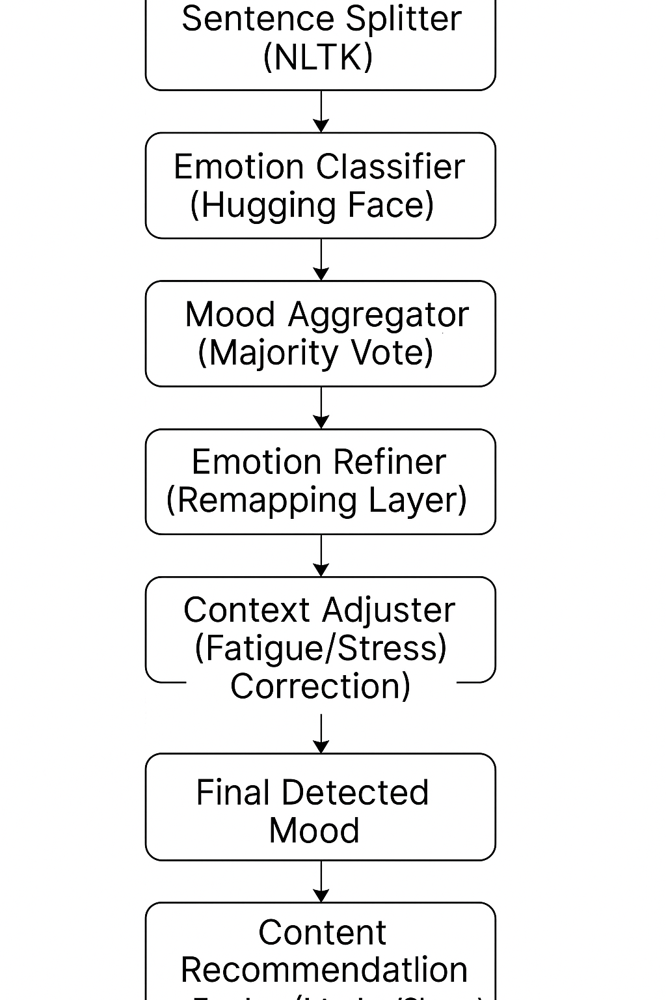
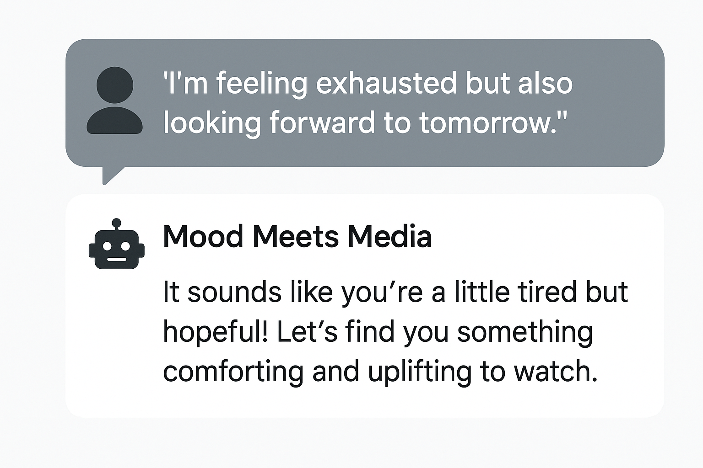

Mood Meets Media 🎬💬

An AI-powered wellness app that recommends movies and shows based on how you feel — not just what you watched last.

## 📈 Project Architecture

Mood Meets Media processes journal entries sentence-by-sentence to detect emotional states, refine context, and recommend personalized media content.

🌟 What It Does

Mood Meets Media is an emotion-aware recommender system built with NLP and explainable AI principles. It helps users choose emotionally aligned content by:

    Analyzing mood using journaling input or emotion selection
    Mapping feelings to media themes via a custom Mood Matrix
    Suggesting content with explainable recommendations
    Supporting emotional transitions (e.g., sad → hopeful)

## Vision

🧠 Tech Stack

    Frontend: Streamlit
    NLP: TextBlob, TF-IDF + Cosine Similarity
    Mood Mapping: Custom emotion-to-theme matrix
    Explainability: Keyword cues from descriptions

🚀 Try It Now

💡 Live Demo: Launch the App on Streamlit
No sign-up needed. Just pick your mood or write how you feel.
📸 Screenshots

Homepage
A clean UI for journaling-based and dropdown-based mood detection.

Explainable Recommendation
Each rec explains why it emotionally fits you.
🛠️ How to Run Locally
Clone the repo:

git clone https://github.com/your-username/mood-meets-media.git
cd mood-meets-media

🚀 Key Features

    ✨ HuggingFace Emotion Classification Model Integration
    ✨ Sentence-Level Mood Aggregation from Journaling Input
    ✨ Smart Emotional Remapping (Hopefulness, Anxiety, Stress Detection)
    ✨ Future-Ready for Custom Fine-Tuning of Emotional States
    ✨ Built with Streamlit for Interactive User Experience!
